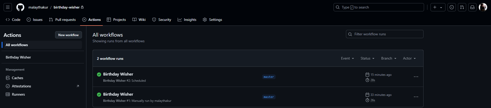
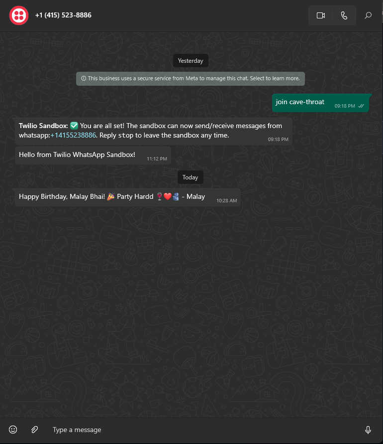

---

# 🎉 Birthday Wisher 🎉

Welcome to the **Birthday Wisher** project! This Python-based automation tool sends personalized birthday wishes via WhatsApp using the Twilio API. It’s designed to ensure that you never miss a friend’s special day!

## ✨ Features

- **Automated Birthday Wishes**: Automatically sends birthday messages based on the current date.
- **Twilio Integration**: Utilizes Twilio’s API to deliver WhatsApp messages.
- **Scheduled Execution**: Runs daily at a specified time to check and send birthday messages.
- **Environment Configuration**: Securely handles credentials using environment variables.

## 🚀 Getting Started

Follow these steps to set up and run Birthday Wisher locally or through GitHub Actions.

### Prerequisites

- Python 3.12.5 or higher
- Twilio Account (for sending WhatsApp messages)
- GitHub account (for automated scheduling)

### Setup

1. **Clone the Repository**

   ```bash
   git clone https://github.com/malaythakur/birthday-wisher.git
   cd birthday-wisher
   ```

2. **Install Dependencies**

   Upgrade `pip` and install the required packages:

   ```bash
   python -m pip install --upgrade pip
   pip install -r requirements.txt
   ```

3. **Configure Environment Variables**

   Create a `.env` file in the root directory with the following content:

   ```plaintext
   TWILIO_ACCOUNT_SID=your_twilio_account_sid
   TWILIO_AUTH_TOKEN=your_twilio_auth_token
   TWILIO_WHATSAPP_NUMBER=whatsapp:+your_twilio_whatsapp_number
   ```

   Replace `your_twilio_account_sid`, `your_twilio_auth_token`, and `your_twilio_whatsapp_number` with your actual Twilio credentials.

4. **Prepare the Data**

   Create a `friends_data.csv` file in the root directory with this structure:

   ```plaintext
   Name,Birthday,PhoneNumber
   Malay Thakur,09-18,918969401606
   ```

   - **Name**: Friend’s name
   - **Birthday**: Birthday in MM-DD format
   - **PhoneNumber**: Friend’s phone number with country code

### 🏃‍♂️ Running the Script

To execute the script manually, run:

```bash
python birthday_wisher.py
```

### 📅 GitHub Actions Setup

1. **Workflow Configuration:**

   

   The GitHub Actions workflow is set to run daily at 10:30 AM IST (05:00 AM UTC). This ensures automatic checks and message dispatches.

2. **Set Up Environment Secrets**

   Configure the following GitHub Secrets in your repository:

   - `TWILIO_ACCOUNT_SID`
   - `TWILIO_AUTH_TOKEN`
   - `TWILIO_WHATSAPP_NUMBER`

### 📩 Example Usage

Once configured, the script will:

- Check for any birthdays listed for the current date.
- Send a WhatsApp message to friends whose birthdays match.

**Example Message:**



Note: The message content shown is an example and was sent to myself for testing purposes.


### 💡 Contributing

Contributions are welcome! Fork the repository and submit pull requests. For significant changes, please open an issue to discuss your ideas first.


### 🤝 Contact

For questions or feedback, reach out to [Malay Thakur](mailto:malaythakur13@example.com).

---
